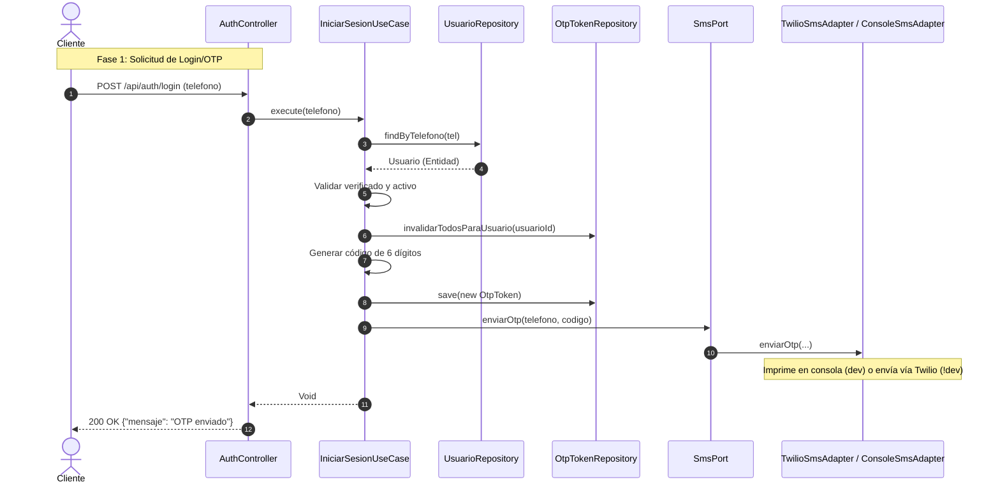
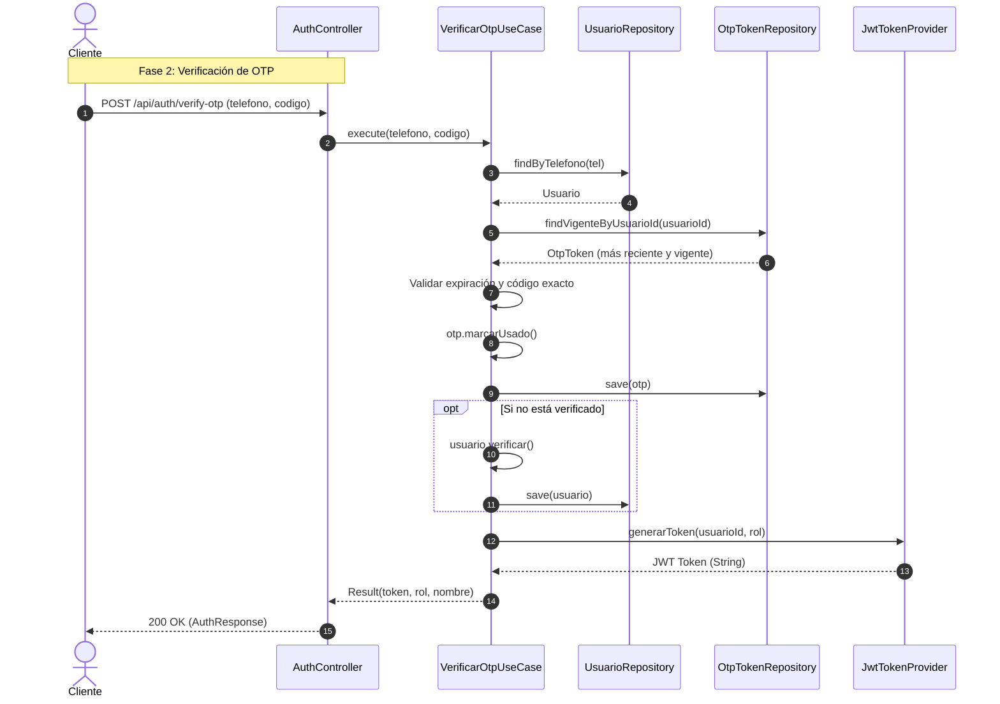
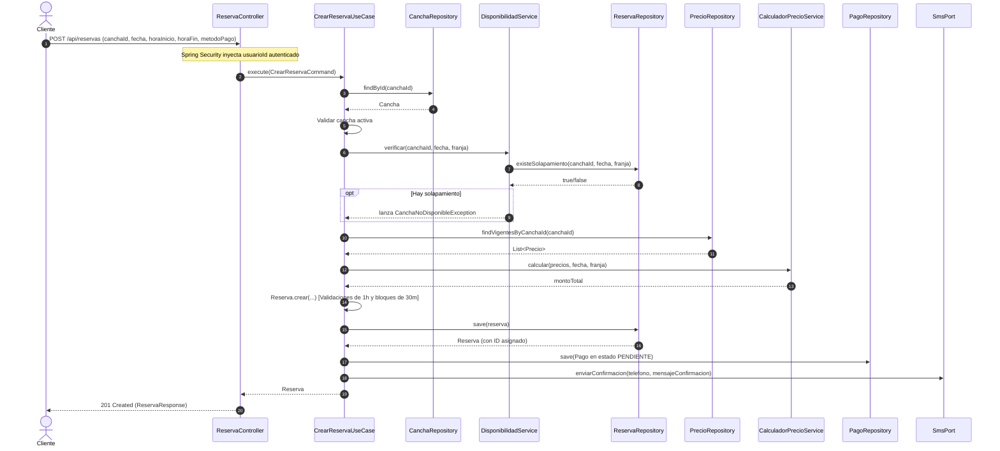

# Arquitectura y Funcionamiento del Backend (Sport App)

Este documento detalla el funcionamiento paso a paso de las funcionalidades de **Login (Autenticación)** y **Reservas**, así como las decisiones de diseño arquitectónico implementadas en el paquete `bo.ucb.sport`.

---

## 1. Diseño Arquitectónico y Patrones de Diseño

El sistema está diseñado bajo los principios de la **Arquitectura Hexagonal (Puertos y Adaptadores)** y **Domain-Driven Design (DDD)**. Esto garantiza un desacoplamiento total entre las reglas del negocio y los detalles tecnológicos (como bases de datos, APIs de mensajería o frameworks web).

### Estructura de Capas
El paquete base `bo.ucb.sport` se organiza de la siguiente manera:
1. **`domain` (Dominio)**: 
   - Contiene el núcleo del negocio. Es código de Java puro, libre de anotaciones de frameworks (como Spring, JPA, Lombok, etc.).
   - **Entidades/Agregados**: Modelan la lógica y las invariantes del negocio (ej. [Usuario](file:///c:/ARQUITECTURA/backend/src/main/java/bo/ucb/sport/domain/model/usuario/Usuario.java) y [Reserva](file:///c:/ARQUITECTURA/backend/src/main/java/bo/ucb/sport/domain/model/reserva/Reserva.java)).
   - **Value Objects**: Objetos inmutables que encapsulan datos y sus validaciones básicas (ej. [Telefono](file:///c:/ARQUITECTURA/backend/src/main/java/bo/ucb/sport/domain/model/usuario/Telefono.java) y [FranjaHoraria](file:///c:/ARQUITECTURA/backend/src/main/java/bo/ucb/sport/domain/model/reserva/FranjaHoraria.java)).
   - **Ports (Puertos)**: Interfaces que definen los requerimientos de comunicación con el exterior (ej. [UsuarioRepository](file:///c:/ARQUITECTURA/backend/src/main/java/bo/ucb/sport/domain/repository/UsuarioRepository.java)).
   - **Servicios de Dominio**: Lógica de negocio pura que no pertenece a una sola entidad (ej. [CalculadorPrecioService](file:///c:/ARQUITECTURA/backend/src/main/java/bo/ucb/sport/domain/service/CalculadorPrecioService.java)).
2. **`application` (Aplicación)**:
   - Contiene los **Casos de Uso** (ej. [CrearReservaUseCase](file:///c:/ARQUITECTURA/backend/src/main/java/bo/ucb/sport/application/usecase/reserva/CrearReservaUseCase.java)) que orquestan los flujos de negocio.
   - Define puertos de salida no-dominio (como [SmsPort](file:///c:/ARQUITECTURA/backend/src/main/java/bo/ucb/sport/application/port/SmsPort.java)).
3. **`infrastructure` (Infraestructura)**:
   - Implementa los **Adaptadores** (ej. acceso a base de datos mediante Spring Data JPA, integración con Twilio).
   - Contiene las entidades JPA específicas de la base de datos (ej. [UsuarioJpa](file:///c:/ARQUITECTURA/backend/src/main/java/bo/ucb/sport/infrastructure/persistence/entity/UsuarioJpa.java)), las configuraciones de Spring y los mecanismos de seguridad.
4. **`interfaces` (Interfaces/Presentación)**:
   - Contiene los controladores REST (ej. [AuthController](file:///c:/ARQUITECTURA/backend/src/main/java/bo/ucb/sport/interfaces/rest/AuthController.java)) y los DTOs de entrada/salida.

### Patrones Utilizados
- **Dependency Inversion Principle (DIP)**: Los Casos de Uso dependen de abstracciones (Puertos), y la infraestructura provee las implementaciones (Adaptadores).
- **Factory Method**: Se emplean métodos estáticos en los agregados de dominio (ej. `Usuario.registrar()` y `Usuario.reconstituir()`) para separar la creación de entidades de negocio de su reconstrucción desde la persistencia.
- **Repository Pattern & Mappers**: Separan las consultas y comandos a la base de datos del modelo del dominio mediante el uso de mappers explícitos (ej. [UsuarioMapper](file:///c:/ARQUITECTURA/backend/src/main/java/bo/ucb/sport/infrastructure/persistence/mapper/UsuarioMapper.java)).

---

## 2. Flujo de Login (Iniciar Sesión e OTP) Paso a Paso

El proceso de autenticación consta de dos fases: solicitud de OTP y verificación de OTP.



### Fase 1: Solicitud de Login/OTP
1. El usuario realiza una petición `POST` a `/api/auth/login` con su número de teléfono.
2. [AuthController](file:///c:/ARQUITECTURA/backend/src/main/java/bo/ucb/sport/interfaces/rest/AuthController.java) recibe el DTO y ejecuta el caso de uso [IniciarSesionUseCase](file:///c:/ARQUITECTURA/backend/src/main/java/bo/ucb/sport/application/usecase/auth/IniciarSesionUseCase.java).
3. `IniciarSesionUseCase` busca al usuario por teléfono a través de `UsuarioRepository`:
   - Si no existe, lanza una `UsuarioNoEncontradoException`.
   - Si el usuario existe pero no está verificado (o está inactivo), lanza una excepción de negocio.
4. Llama a `OtpTokenRepository.invalidarTodosParaUsuario(usuarioId)`, ejecutando una consulta `@Modifying` de actualización de JPA para marcar como usados (`usado = true`) todos los OTPs anteriores del usuario.
5. Genera un número aleatorio de 6 dígitos (`100_000` - `999_999`) usando `SecureRandom`.
6. Crea un objeto de dominio [OtpToken](file:///c:/ARQUITECTURA/backend/src/main/java/bo/ucb/sport/domain/model/usuario/OtpToken.java) parametrizado con fecha de expiración a **5 minutos** en el futuro.
7. Guarda el token en la base de datos a través de `OtpTokenRepository.save(...)`.
8. Llama a `SmsPort.enviarOtp(telefono, codigo)` para notificar al usuario.



### Fase 2: Verificación del OTP
1. El usuario envía el código recibido mediante un `POST` a `/api/auth/verify-otp`.
2. El controlador delega a [VerificarOtpUseCase](file:///c:/ARQUITECTURA/backend/src/main/java/bo/ucb/sport/application/usecase/auth/VerificarOtpUseCase.java).
3. Busca al usuario y obtiene el último `OtpToken` activo mediante `OtpTokenRepository.findVigenteByUsuarioId(usuarioId)`.
4. El caso de uso realiza las siguientes validaciones en el dominio:
   - Que exista un OTP activo.
   - Que el OTP no haya expirado (`estaVigente()`).
   - Que el código coincida exactamente.
5. Si las validaciones pasan, se marca el OTP como usado (`otp.marcarUsado()`) y se guarda a través de `OtpTokenRepository.save()`.
6. Si es la primera vez que se valida el OTP de este usuario (durante el registro), se cambia el estado del usuario a verificado (`usuario.verificar()`) y se persiste.
7. Se genera un token JWT firmado mediante el [JwtTokenProvider](file:///c:/ARQUITECTURA/backend/src/main/java/bo/ucb/sport/infrastructure/security/JwtTokenProvider.java) conteniendo el ID del usuario y su rol.
8. Retorna la respuesta exitosa con el token, rol y nombre del usuario.

---

## 3. Flujo de Reservas Paso a Paso

El proceso para crear una reserva de cancha incluye validaciones de horarios y cálculo dinámico de precios.



### Proceso de Creación de Reserva
1. El cliente envía los parámetros de reserva a `POST /api/reservas`. El controlador [ReservaController](file:///c:/ARQUITECTURA/backend/src/main/java/bo/ucb/sport/interfaces/rest/ReservaController.java) extrae el `usuarioId` del contexto de seguridad (inyectado por el token JWT) y crea un `CrearReservaCommand`.
2. Se ejecuta [CrearReservaUseCase](file:///c:/ARQUITECTURA/backend/src/main/java/bo/ucb/sport/application/usecase/reserva/CrearReservaUseCase.java).
3. **Paso 1: Obtener y validar cancha:** Se busca la cancha deportiva por ID. Se valida que esté activa (`cancha.isActiva()`).
4. **Paso 2: Validar disponibilidad de horario (Evitar solapamientos):**
   - Llama al servicio de dominio [DisponibilidadService](file:///c:/ARQUITECTURA/backend/src/main/java/bo/ucb/sport/domain/service/DisponibilidadService.java).
   - Éste delega en el repositorio la consulta `existeSolapamiento(canchaId, fecha, franja)`.
   - La consulta JPQL asociada en [ReservaJpaRepository](file:///c:/ARQUITECTURA/backend/src/main/java/bo/ucb/sport/infrastructure/persistence/jpa/ReservaJpaRepository.java) valida si existe otra reserva no cancelada en la misma fecha y cancha donde se cumpla: `horaInicio < :fin_solicitado AND horaFin > :inicio_solicitado`.
   - Si existe conflicto, lanza `CanchaNoDisponibleException`. (Nota: La base de datos relacional PostgreSQL también suele reforzarse con un constraint de exclusión `GiST` para evitar condiciones de carrera).
5. **Paso 3: Cálculo del precio de la reserva:**
   - Obtiene la lista de precios vigentes configurados para esa cancha.
   - Delega la lógica en [CalculadorPrecioService](file:///c:/ARQUITECTURA/backend/src/main/java/bo/ucb/sport/domain/service/CalculadorPrecioService.java).
   - El calculador evalúa prioridades (Regla de negocio `RN-14`): **Feriados > Días específicos de la semana > Precio general base**.
   - Calcula el total proporcional basándose en los minutos solicitados (`costoHora * (minutos / 60.0)`).
6. **Paso 4: Creación de la Entidad Reserva:**
   - Llama a `Reserva.crear(...)` que valida las invariantes del negocio:
     - Duración mínima de 1 hora (`RN-06`).
     - Duración en bloques o múltiplos exactos de 30 minutos (`RN-07`).
   - El estado de la reserva se inicializa como `PENDIENTE`.
   - Se persiste la reserva en la base de datos vía `ReservaRepository.save()`.
7. **Paso 5: Registro del Pago:**
   - Crea una entidad `Pago` en estado `PENDIENTE` asociada a la reserva recién creada por el monto total calculado.
   - Se persiste vía `PagoRepository.save()`.
8. **Paso 6: Envío de Confirmación:**
   - Recupera el teléfono del usuario e invoca a `SmsPort.enviarConfirmacion(...)` para notificarle los detalles de la reserva (cancha, fecha, horas y costo).

---

## 4. Desacoplamiento de Servicios Externos: El caso de Twilio

El backend no depende directamente del SDK de Twilio en su núcleo de aplicación. Esto se logra mediante el patrón de arquitectura hexagonal utilizando **Puertos** y **Adaptadores**.

```
[ Capa de Aplicación ]              [ Capa de Infraestructura ]
+--------------------+              +-------------------------+
|     <<Port>>       |              |   TwilioSmsAdapter      | ---> Envía por Twilio SDK
|     SmsPort        |<|------------| (Active if: !dev)       |
+--------------------+              +-------------------------+
                                    |   ConsoleSmsAdapter     | ---> Imprime en logs/consola
                                    | (Active if: dev)        |
                                    +-------------------------+
```

1. **Definición del Puerto:** En `application/port`, se define la interfaz [SmsPort](file:///c:/ARQUITECTURA/backend/src/main/java/bo/ucb/sport/application/port/SmsPort.java). Esta interfaz solo conoce tipos primitivos y de dominio, aislando el caso de uso de dependencias de terceros.
2. **Implementación de Adaptadores:** En `infrastructure/sms`, se crean dos implementaciones del puerto:
   - [TwilioSmsAdapter](file:///c:/ARQUITECTURA/backend/src/main/java/bo/ucb/sport/infrastructure/sms/TwilioSmsAdapter.java): Utiliza el SDK oficial de Twilio (`com.twilio.rest.api.v2010.account.Message`) y carga dinámicamente credenciales desde la configuración de Spring (`twilio.account-sid`, `twilio.auth-token`, `twilio.phone-number`).
   - [ConsoleSmsAdapter](file:///c:/ARQUITECTURA/backend/src/main/java/bo/ucb/sport/infrastructure/sms/ConsoleSmsAdapter.java): Simplemente escribe los mensajes de salida en el log de la consola.
3. **Gestión de Entornos mediante Spring Profiles:**
   - `ConsoleSmsAdapter` está anotado con `@Profile("dev")`.
   - `TwilioSmsAdapter` está anotado con `@Profile("!dev")`.
   Esto permite que en desarrollo no sea necesario configurar cuentas de Twilio ni consumir saldo real; el desarrollador puede ver el código OTP directamente en la consola de ejecución. En producción u otros entornos, se inyecta automáticamente el adaptador de Twilio de forma transparente para los casos de uso.

---

## 5. Estrategia de Persistencia de Base de Datos

La persistencia combina el **Repository Pattern** del dominio con **Spring Data JPA** en la infraestructura para lograr un desacoplamiento limpio del motor SQL y sus anotaciones.

```
       Capa de Dominio                     Capa de Infraestructura
 +-------------------------+     +-------------------------+     +-----------------------+
 |    <<Repository>>       |     |  UsuarioRepositoryImpl  |     | UsuarioJpaRepository  |
 |   UsuarioRepository     |<|---|      (@Repository)      |---->|   (extends JPA Rep.)  |
 +-------------------------+     +-------------------------+     +-----------------------+
              ^                               |                             |
              | (Opera con)                   | (Utiliza)                   | (Opera con)
              v                               v                             v
       [ Usuario.java ]                [ UsuarioMapper ]             [ UsuarioJpa.java ]
     (Entidad de Dominio)                (Traductor)                 (Entidad de Tabla DB)
```

1. **Entidades Libres de JPA**: El modelo de dominio [Usuario.java](file:///c:/ARQUITECTURA/backend/src/main/java/bo/ucb/sport/domain/model/usuario/Usuario.java) es un POJO regular sin anotaciones `@Entity` ni de base de datos.
2. **Entidades JPA de Tabla**: En la infraestructura se define [UsuarioJpa.java](file:///c:/ARQUITECTURA/backend/src/main/java/bo/ucb/sport/infrastructure/persistence/entity/UsuarioJpa.java) el cual contiene las anotaciones `@Entity`, `@Table`, `@Column` y las estrategias de generación de llaves requeridas por Hibernate/JPA.
3. **Traducción mediante Mappers**: El componente [UsuarioMapper](file:///c:/ARQUITECTURA/backend/src/main/java/bo/ucb/sport/infrastructure/persistence/mapper/UsuarioMapper.java) se encarga de convertir de ida y vuelta:
   - `toDomain(UsuarioJpa jpa)`: Convierte el registro de BD al objeto de negocio usando el método de fábrica `Usuario.reconstituir()`.
   - `toJpa(Usuario domain)`: Mapea el estado actual del objeto de negocio en una entidad JPA lista para persistir.
4. **Implementación de Puertos (Adaptadores)**: 
   - [UsuarioRepositoryImpl](file:///c:/ARQUITECTURA/backend/src/main/java/bo/ucb/sport/infrastructure/persistence/repository/UsuarioRepositoryImpl.java) implementa la interfaz del dominio `UsuarioRepository`.
   - Dentro de esta clase, se inyecta la interfaz de Spring Data [UsuarioJpaRepository](file:///c:/ARQUITECTURA/backend/src/main/java/bo/ucb/sport/infrastructure/persistence/jpa/UsuarioJpaRepository.java) (que extiende `JpaRepository`).
   - El adaptador implementa los métodos de la interfaz de dominio delegando las llamadas a Spring Data JPA y usando el mapper para mantener las firmas desacopladas.

Esta separación asegura que si en el futuro se desea migrar la persistencia de JPA (PostgreSQL) a NoSQL (MongoDB) o JDBC plano, las entidades de dominio y los casos de uso permanecen intactos; solo se requiere programar un nuevo adaptador en la capa de infraestructura.
