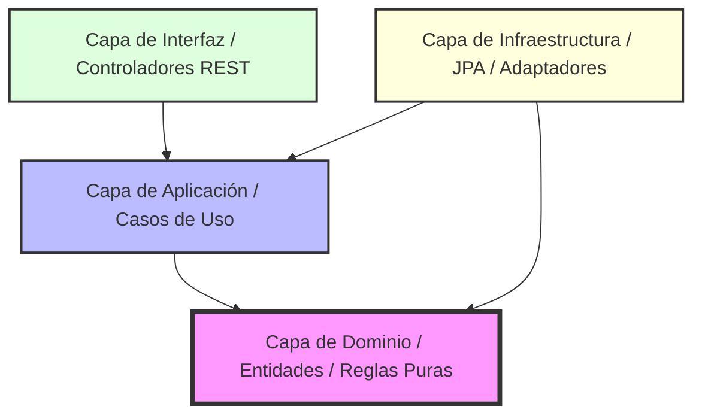
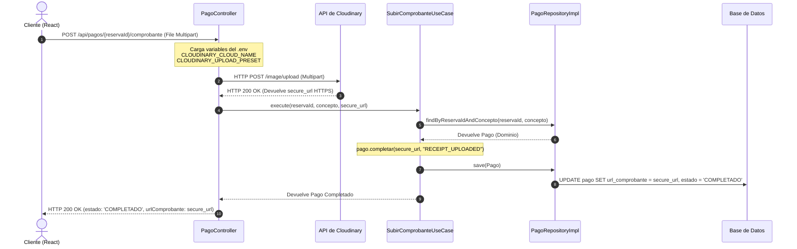
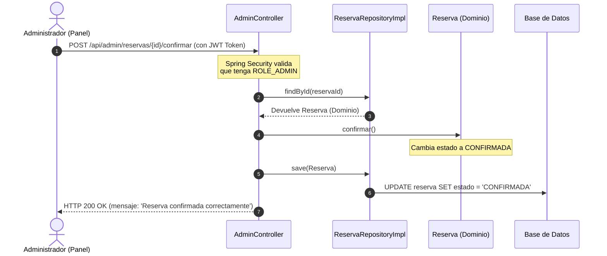

# 📘 Explicación del Código y Arquitectura del Sistema — SPORT ACADEMY

Esta guía técnica explica la arquitectura del sistema **SPORT ACADEMY**, detallando el diseño de software basado en **Domain-Driven Design (DDD)**, la separación de responsabilidades en capas y los flujos exactos de comunicación entre los componentes del frontend (React) y el backend (Spring Boot).

---

## 🏛️ 1. Estructura Arquitectónica (DDD)

El backend está diseñado siguiendo los principios de la **Arquitectura Limpia (Clean Architecture)** y **Domain-Driven Design (DDD)**. El software está dividido en 4 capas concéntricas aisladas, donde las dependencias siempre apuntan hacia adentro (el Dominio es el centro y no depende de nada externo).



### 1. Capa de Dominio (Domain Layer) — `bo.ucb.sport.domain`
Es el núcleo de la aplicación. Aquí residen los modelos de negocio puros, los enums, las excepciones y los contratos (interfaces/puertos) de persistencia. Está totalmente aislada de frameworks como Spring o Hibernate.

* **Agregado Raíz (Aggregate Root)**:
  * [Reserva.java](file:///c:/ARQUITECTURA/backend/src/main/java/bo/ucb/sport/domain/model/reserva/Reserva.java): Encapsula la lógica de las reservas de canchas. Protege las invariantes de negocio (ej. la regla estricta de duración mínima de 1 hora) y realiza las transiciones de estado a través de métodos explícitos de negocio: `confirmar()`, `cancelar()`, `ampliar()`.
* **Entidad de Dominio (Domain Entity)**:
  * [Pago.java](file:///c:/ARQUITECTURA/backend/src/main/java/bo/ucb/sport/domain/model/pago/Pago.java): Modela la transacción financiera de una reserva (ya sea reserva inicial o ampliaciones). Define comportamientos como `completar(urlComprobante, referencia)` y `rechazar()`.
* **Value Objects**:
  * `FranjaHoraria.java` (invariante de rango horario de la reserva) y `ReservaId.java`.
* **Puertos de Dominio (Domain Ports)**:
  * `ReservaRepository.java` y `PagoRepository.java`: Definen las interfaces puras que la aplicación utiliza para persistir datos.

### 2. Capa de Aplicación (Application Layer) — `bo.ucb.sport.application`
Coordina los flujos de la aplicación y orquesta los casos de uso específicos. Traduce las intenciones del usuario en interacciones con el dominio.

* **Casos de Uso (Use Cases)**:
  * [SubirComprobanteUseCase.java](file:///c:/ARQUITECTURA/backend/src/main/java/bo/ucb/sport/application/usecase/pago/SubirComprobanteUseCase.java): Modifica el estado del `Pago` a `COMPLETADO` vinculando la URL de la imagen del comprobante de Cloudinary. Deja la reserva en estado `PENDIENTE` para verificación manual.
  * `CrearReservaUseCase.java`: Valida la disponibilidad horaria de la cancha antes de registrar una reserva en estado `PENDIENTE_PAGO`.
  * `RegistrarPagoPresencialUseCase.java`: Caso de uso en el que un administrador confirma una reserva cobrando en efectivo (marca el pago como completado y llama inmediatamente a `reserva.confirmar()`).

### 3. Capa de Infraestructura (Infrastructure Layer) — `bo.ucb.sport.infrastructure`
Contiene todos los detalles tecnológicos externos: bases de datos, mappers JPA, configuración web y adapters de servicios externos.

* **Adaptadores de Persistencia (Adapters)**:
  * `ReservaRepositoryImpl.java` and `PagoRepositoryImpl.java`: Implementan las interfaces de repositorio del Dominio. Inyectan los repositorios de Spring Data JPA (`ReservaJpaRepository` y `PagoJpaRepository`) y usan traductores/mappers (`ReservaMapper`, `PagoMapper`) para convertir entidades JPA de base de datos a objetos de dominio puros.
* **Seguridad y Configuración**:
  * `SecurityConfig.java`: Configura filtros JWT stateless y define las políticas de control de acceso.
  * `WebConfig.java`: Registra las configuraciones MVC generales de la aplicación.

### 4. Capa de Interfaces/Presentación (Interface Layer) — `bo.ucb.sport.interfaces`
Expone los puntos de entrada para el exterior (controladores REST HTTP y DTOs).

* **Controladores REST (REST Controllers)**:
  * [PagoController.java](file:///c:/ARQUITECTURA/backend/src/main/java/bo/ucb/sport/interfaces/rest/PagoController.java): Expone el endpoint de comprobante. Gestiona de manera nativa la subida física del archivo multipart hacia la API de Cloudinary y delega al caso de uso.
  * [AdminController.java](file:///c:/ARQUITECTURA/backend/src/main/java/bo/ucb/sport/interfaces/rest/AdminController.java): Proporciona endpoints específicos para los administradores (creación de canchas, configuración de precios y confirmación manual de reservas pendientes).
  * `ReservaController.java` y `AuthController.java`.

---

## 📡 2. Flujo de Comunicación e Interacción entre Componentes

A continuación se detalla gráficamente cómo interactúan el cliente y el servidor en los procesos críticos.

### Flujo A: Subida de Comprobante QR (Usuario)
Cuando un usuario crea una reserva online y sube una captura del comprobante bancario, la interacción fluye a través del backend actuando como proxy seguro hacia **Cloudinary**:



### Flujo B: Aprobación / Confirmación Manual (Administrador)
Una vez que el comprobante se ha subido con éxito a Cloudinary, el pago está `COMPLETADO` pero la reserva permanece `PENDIENTE` bloqueando temporalmente el slot. El administrador evalúa la imagen desde su panel y realiza la confirmación manual:



---

## 🛠️ 3. Explicación de Claves Técnicas de Implementación

### 1. Proxy Seguro a Cloudinary en `PagoController.java`
Para evitar exponer claves privadas en el frontend del cliente o forzar al frontend a implementar código adicional de red, el backend Spring Boot actúa como un **Proxy Transparente**:
* El archivo `.env` del root es cargado automáticamente al inicio del sistema por un cargador estático en `SportApplication.java`.
* Al recibir el archivo, `PagoController.java` valida las credenciales y ejecuta una llamada HTTP Multipart sincrónica con Spring `RestTemplate` hacia los servidores de Cloudinary.
* Al obtener el enlace HTTPS de Cloudinary, lo introduce directamente al dominio de pagos y limpia la memoria. No se almacena nada localmente en disco, eliminando errores de rutas temporales.

### 2. Mapeadores de Datos (Data Mappers) en Capa de Persistencia
Para mantener las clases de base de datos JPA (`@Entity`) completamente aisladas de los modelos de negocio puros, se inyectan mappers:
* **Entidades JPA**: `ReservaJpa` y `PagoJpa` están anotadas con anotaciones de Hibernate/Spring y representan tablas de base de datos relacionales.
* **Mapeadores**: Clases como `ReservaMapper.java` contienen métodos estáticos para reconstituir entidades del dominio a partir de registros JPA:
  ```java
  public static Reserva toDomain(ReservaJpa jpa) {
      return Reserva.reconstituir(
          new ReservaId(jpa.getId()), 
          jpa.getUsuarioId(), 
          jpa.getCanchaId(),
          ...
      );
  }
  ```
* **Guardado**: Cuando un caso de uso modifica el dominio (ej: `pago.completar(...)`), el Repositorio de la Infraestructura traduce el objeto de dominio modificado de vuelta a un Entity JPA usando el mapper, y llama a `jpaRepository.save(entity)`.

---

## 🔐 4. Control de Acceso y Seguridad

El flujo de seguridad del backend está centralizado en el componente [SecurityConfig.java](file:///c:/ARQUITECTURA/backend/src/main/java/bo/ucb/sport/infrastructure/security/SecurityConfig.java):
1. **JWT Stateless**: Se utiliza `JwtAuthenticationFilter.java` para interceptar cada petición HTTP entrante, extraer el token JWT del header `Authorization: Bearer <token>`, validar su firma, y poblar el contexto de Spring Security con los roles y el identificador del usuario.
2. **Autorizaciones Declarativas**:
   * Las rutas `/api/auth/**` son de acceso libre (registro, login, envío de SMS Twilio).
   * Las rutas bajo `/api/admin/**` están estrictamente limitadas a administradores a nivel de red mediante la regla `.requestMatchers("/api/admin/**").hasRole("ADMIN")`.
   * Cualquier otro endpoint requiere autenticación obligatoria.
