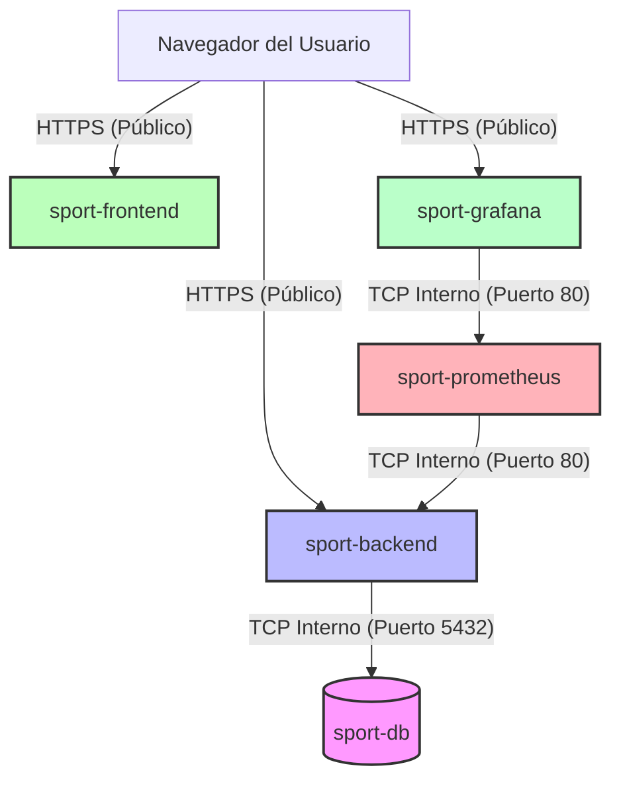

# 🚀 Guía de Despliegue en la Nube desde Cero (Azure Container Apps)

Este documento detalla el procedimiento completo paso a paso con todos los comandos reales necesarios para desplegar la aplicación **SPORT-3** en la nube de Azure desde cero.

---

## 🏗️ 1. Resumen de Arquitectura de Red (TCP Interno y Monitoreo)

Todos los servicios se despliegan en el mismo **Entorno de Azure Container Apps (Environment)**, el cual actúa como una red privada aislada.



* **sport-db**: Ingress interno en puerto `5432`. Solo accesible por el backend.
* **sport-backend**: Se comunica con la BD en `sport-db:5432`. Expone `/actuator/prometheus` en el puerto `8080` (interno puerto `80` en Azure).
* **sport-frontend**: Llama al backend público mediante la URL inyectada en compilación.
* **sport-prometheus**: Ingress interno en puerto `9090` (mapeado a puerto `80` por Azure). Consume métricas del backend llamando a `sport-backend:80`.
* **sport-grafana**: Ingress público en puerto `3000`. Consume datos de `sport-prometheus:80` (Prometheus interno).

---

## 🛠️ 2. Requisitos Previos

Asegúrate de tener instalados y corriendo:
- **Docker Desktop** (Debe estar iniciado)
- **Azure CLI**
- Cuenta de **Docker Hub** y suscripción activa en **Azure**.

Inicia sesión en tus herramientas desde la terminal (PowerShell):
```powershell
# Iniciar sesión en Docker Hub
docker login

# Iniciar sesión en Azure
az login
```

---

## 🚀 3. Guía Paso a Paso del Despliegue

Sigue el orden estricto de los siguientes pasos para desplegar toda la infraestructura.

### Paso 1: Registrar Proveedores y Crear el Entorno en Azure

Registra los proveedores obligatorios (esto solo se realiza una vez por cuenta) y crea la red privada virtual de Azure (Container Apps Environment).

```powershell
# 1. Registrar proveedores en tu suscripción de Azure
az provider register -n Microsoft.OperationalInsights --wait
az provider register -n Microsoft.App --wait

# 2. Crear el Grupo de Recursos
az group create --name DefaultResourceGroup-SCUS --location southcentralus

# 3. Crear el Entorno de Container Apps (Sin Log Analytics para evitar restricciones de políticas de Azure)
az containerapp env create --name env-sport --resource-group DefaultResourceGroup-SCUS --location southcentralus --logs-destination none
```

---

### Paso 2: Desplegar la Base de Datos (PostgreSQL)

Crea el contenedor con la imagen oficial de Postgres en modo **interno** (seguro contra accesos externos de Internet).

```powershell
az containerapp create `
  --name sport-db `
  --resource-group DefaultResourceGroup-SCUS `
  --environment env-sport `
  --image postgres:15-alpine `
  --target-port 5432 `
  --ingress internal `
  --min-replicas 1 `
  --max-replicas 1 `
  --env-vars POSTGRES_USER=postgres POSTGRES_PASSWORD=DBA123 POSTGRES_DB=sport_db
```

---

### Paso 3: Desplegar el Backend (Spring Boot)

#### 📝 Explicación de los Parámetros Especiales:
1. **`stringtype=unspecified`**: Necesario en PostgreSQL para evitar errores al guardar o comparar **Enums**. Le dice al driver JDBC de Postgres que envíe los textos sin un tipo asignado para que la base de datos haga la coerción implícita a los enums locales.
2. **PowerShell y el ampersand (`&`)**: Dado que el operador `&` se interpreta en PowerShell como separador de comandos, no usamos `&sslmode=disable` para conectarnos internamente (no es necesario SSL entre apps de Azure). Así, la URL solo usa `?stringtype=unspecified` y evitamos errores de escape en la terminal.

#### 1. Compilar y subir la imagen (Ejecutar en la raíz del proyecto `c:\SARQ\SPORT-3`):
```powershell
docker build -t swidenx520/sport-backend:latest ./backend
docker push swidenx520/sport-backend:latest
```

#### 2. Crear el Container App del Backend:
*(Comando real con credenciales y configuración OTP de Twilio)*
```powershell
az containerapp create `
  --name sport-backend `
  --resource-group DefaultResourceGroup-SCUS `
  --environment env-sport `
  --image swidenx520/sport-backend:latest `
  --target-port 8080 `
  --ingress external `
  --min-replicas 1 `
  --max-replicas 1 `
  --env-vars `
    SPRING_DATASOURCE_URL="jdbc:postgresql://sport-db:5432/sport_db?stringtype=unspecified" `
    SPRING_DATASOURCE_USERNAME="postgres" `
    SPRING_DATASOURCE_PASSWORD="REDACTED_DB_PASSWORD" `
    SPRING_PROFILES_ACTIVE="prod" `
    JWT_SECRET="REDACTED_JWT_SECRET" `
    TWILIO_ACCOUNT_SID="REDACTED_TWILIO_ACCOUNT_SID" `
    TWILIO_AUTH_TOKEN="REDACTED_TWILIO_AUTH_TOKEN" `
    TWILIO_PHONE_NUMBER="+17017606598"
```

> 📝 **IMPORTANTE**: Al finalizar, copia la URL pública de salida de tu backend (por ejemplo: `https://sport-backend.whitebay-232ffa18.southcentralus.azurecontainerapps.io`). La utilizaremos en el siguiente paso para compilar el Frontend.

---

### Paso 4: Desplegar el Frontend (React + Vite)

#### 📝 Explicación de los Parámetros Especiales:
1. **Compilación Estática**: En React + Vite, las variables de entorno se inyectan físicamente en el código JavaScript compilado durante la creación de la imagen. Cambiar las variables de entorno en la consola de Azure Container Apps para el frontend **no tiene efecto** porque el navegador web descarga archivos estáticos precompilados.
2. **Evitar Sobreescrituras**: El Dockerfile ya no tiene variables por defecto `ARG VITE_API_URL`, lo que significa que el archivo `.env.production` es la única fuente de verdad para inyectar la URL.

#### 1. Configurar la URL de Azure en el Frontend:
Edita o crea el archivo [frontend/.env.production](file:///c:/SARQ/SPORT-3/frontend/.env.production) con la URL pública de tu backend obtenida en el Paso 3:
```env
VITE_API_URL=https://sport-backend.whitebay-232ffa18.southcentralus.azurecontainerapps.io
```

#### 2. Compilar y subir la imagen (Ejecutar en la raíz del proyecto `c:\SARQ\SPORT-3`):
```powershell
docker build --no-cache -t swidenx520/sport-frontend:latest ./frontend
docker push swidenx520/sport-frontend:latest
```

#### 3. Crear el Container App del Frontend:
```powershell
az containerapp create `
  --name sport-frontend `
  --resource-group DefaultResourceGroup-SCUS `
  --environment env-sport `
  --image swidenx520/sport-frontend:latest `
  --target-port 80 `
  --ingress external `
  --min-replicas 1 `
  --max-replicas 1
```

---

### Paso 5: Probar y Forzar Recarga de Caché

Dado que los navegadores guardan en caché los archivos index.html y assets de forma agresiva, la primera vez que entres a la URL del frontend (`https://sport-frontend...`) tu navegador puede intentar llamar al backend antiguo o a `localhost:8080`.

1. Abre tu navegador e ingresa a tu URL de frontend.
2. Abre la consola de desarrollo del navegador (**F12**).
3. Haz clic derecho sobre el botón de **Recargar** 🔄 de la barra del navegador y selecciona **"Vaciar la caché y volver a cargar de manera forzada"** (Empty Cache and Hard Reload).
4. O simplemente abre una **Ventana de Incógnito** (Ctrl + Shift + N) y prueba allí. ¡El registro de usuarios y el envío de SMS OTP de Twilio funcionarán inmediatamente!

---

### Paso 6: Desplegar la Pila de Monitoreo (Prometheus + Grafana)

Implementamos una solución de monitoreo robusta para observar el comportamiento de la JVM de Spring Boot, el rendimiento HTTP y el estado del pool de base de datos.

#### 1. Configurar y Desplegar Prometheus
Prometheus se encarga de recopilar (scraping) las métricas que expone el backend en `/actuator/prometheus` cada 10 segundos.

* **Archivo de Configuración (`monitoring/prometheus/prometheus.yml`)**:
  ```yaml
  global:
    scrape_interval: 15s
    evaluation_interval: 15s

  scrape_configs:
    - job_name: 'spring-actuator'
      metrics_path: '/actuator/prometheus'
      scrape_interval: 10s
      static_configs:
        - targets: ['sport-backend:80']
  ```
  *(Nota: Apuntamos a `sport-backend:80` ya que dentro de la red interna de Azure Container Apps, los servicios con ingress se exponen en el puerto 80 por defecto).*

* **Compilar y subir la imagen de Prometheus**:
  ```powershell
  docker build -t swidenx520/sport-prometheus:latest ./monitoring/prometheus
  docker push swidenx520/sport-prometheus:latest
  ```

* **Crear el Container App de Prometheus (Interno)**:
  ```powershell
  az containerapp create `
    --name sport-prometheus `
    --resource-group DefaultResourceGroup-SCUS `
    --environment env-sport `
    --image swidenx520/sport-prometheus:latest `
    --target-port 9090 `
    --ingress internal `
    --min-replicas 1 `
    --max-replicas 1
  ```

#### 2. Configurar y Desplegar Grafana
Grafana se aprovisiona automáticamente con el DataSource de Prometheus, un Dashboard personalizado de la JVM y 5 reglas de alertas críticas precargadas.

* **Configuración del DataSource (`monitoring/grafana/provisioning/datasources/datasource.yml`)**:
  Establece Prometheus como origen de datos predeterminado apuntando a la URL interna:
  ```yaml
  apiVersion: 1
  datasources:
    - name: Prometheus
      type: prometheus
      uid: prometheus-sport
      access: proxy
      url: http://sport-prometheus
      isDefault: true
  ```

* **Alertas Aprovisionadas (`monitoring/grafana/provisioning/alerting/alerts.yml`)**:
  Se crearon 5 alertas con evaluación automática de estado:
  1. **High CPU Usage**: Dispara si el uso de CPU de la JVM es mayor al 85% por más de 2 minutos.
  2. **High JVM Heap Memory**: Dispara si el uso de memoria Heap supera el 90% por más de 2 minutos.
  3. **High HTTP 5xx Error Rate**: Dispara si la tasa de errores HTTP 5xx es mayor a 0.05 en un minuto.
  4. **High HTTP Response Latency**: Dispara si el tiempo de respuesta máximo excede los 2 segundos por más de 2 minutos.
  5. **Hikari DB Pool Exhausted**: Dispara si hay más de 3 peticiones esperando conexiones del pool de BD por más de 1 minuto.

* **Compilar y subir la imagen de Grafana**:
  Usamos un tag versionado (por ejemplo, `:v2`) para que Azure detecte el cambio de imagen de manera unívoca y despliegue una nueva revisión:
  ```powershell
  docker build -t swidenx520/sport-grafana:v2 ./monitoring/grafana
  docker push swidenx520/sport-grafana:v2
  ```

* **Crear o actualizar el Container App de Grafana (Público)**:
  ```powershell
  az containerapp create `
    --name sport-grafana `
    --resource-group DefaultResourceGroup-SCUS `
    --environment env-sport `
    --image swidenx520/sport-grafana:v2 `
    --target-port 3000 `
    --ingress external `
    --min-replicas 1 `
    --max-replicas 1
  ```
  *(Las credenciales de acceso por defecto configuradas son: Usuario: `admin` / Contraseña: `admin`).*

---

## 🔄 4. Cómo Realizar Actualizaciones (Mantenimiento)

Si haces cambios en el código local y deseas subirlos a producción:

### Para el Backend:
```powershell
# 1. Compilar y subir imagen
docker build -t swidenx520/sport-backend:latest ./backend
docker push swidenx520/sport-backend:latest

# 2. Indicar a Azure que actualice con la última imagen
az containerapp update --name sport-backend --resource-group DefaultResourceGroup-SCUS --image swidenx520/sport-backend:latest
```

### Para el Frontend:
*(Asegúrate de que la URL de `frontend/.env.production` sigue siendo correcta)*
```powershell
# 1. Compilar y subir imagen sin caché para forzar la inyección de la URL
docker build --no-cache -t swidenx520/sport-frontend:latest ./frontend
docker push swidenx520/sport-frontend:latest

# 2. Indicar a Azure que actualice con la última imagen
az containerapp update --name sport-frontend --resource-group DefaultResourceGroup-SCUS --image swidenx520/sport-frontend:latest
```

### Para Prometheus o Grafana:
```powershell
# Ejemplo para Grafana usando tags incrementales (v3, v4, etc.) para forzar la actualización
docker build -t swidenx520/sport-grafana:v3 ./monitoring/grafana
docker push swidenx520/sport-grafana:v3

az containerapp update --name sport-grafana --resource-group DefaultResourceGroup-SCUS --image swidenx520/sport-grafana:v3
```

---

## 🔍 5. Diagnóstico de Errores Comunes

* **Ver los SMS / Logs de Spring Boot en tiempo real (OTP y Migraciones de base de datos)**:
  ```powershell
  az containerapp logs show --name sport-backend --resource-group DefaultResourceGroup-SCUS --follow
  ```

* **Ver los logs de Prometheus o Grafana**:
  ```powershell
  az containerapp logs show --name sport-prometheus --resource-group DefaultResourceGroup-SCUS --follow
  az containerapp logs show --name sport-grafana --resource-group DefaultResourceGroup-SCUS --follow
  ```

* **Ver el estado y nombres de las revisiones**:
  ```powershell
  az containerapp list --resource-group DefaultResourceGroup-SCUS -o table
  ```

* **Reiniciar un contenedor / revisión**:
  ```powershell
  az containerapp revision restart --name sport-backend --resource-group DefaultResourceGroup-SCUS --revision <nombre-revision>
  ```
